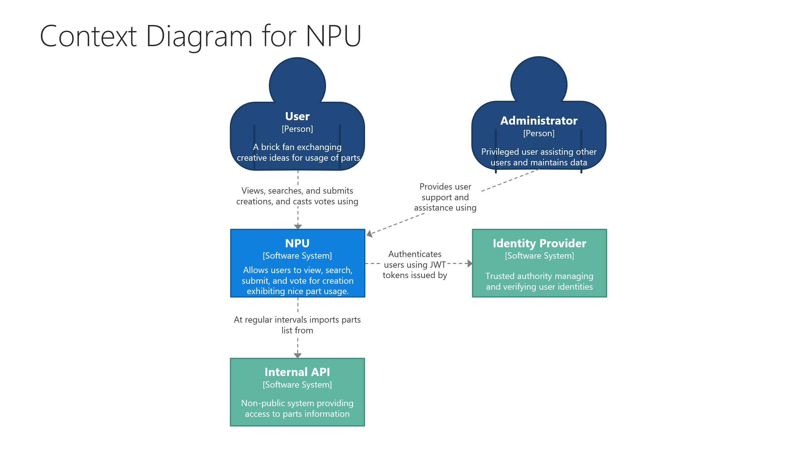
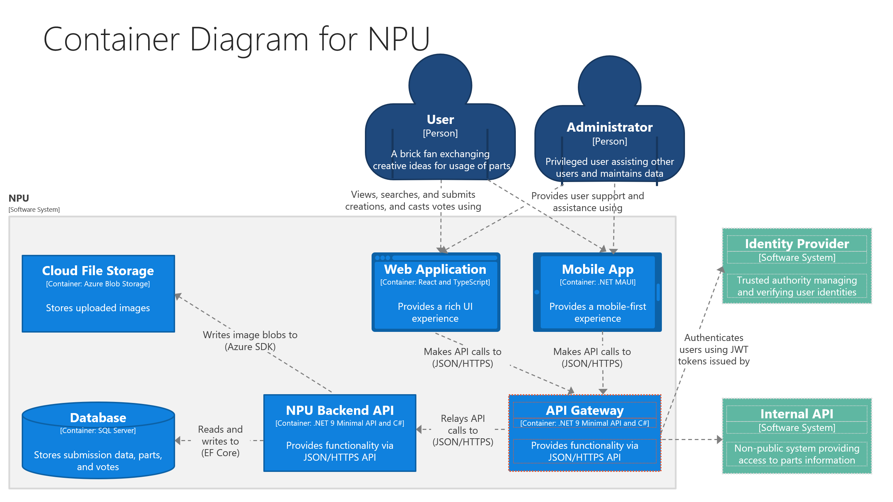
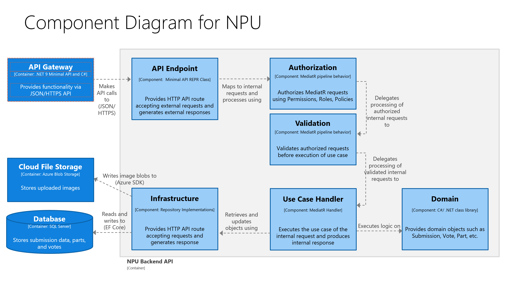

# NPU Backend Case Assignment

Enclosed please find the accompanying files for the NPU Backend assignment. :-)

It's a functional, runnable (but slightly limited) version of the backend exhibiting a standard
REST interface with RFC7807 errors.

The code is based on a Clean Architecture template composed of distinct bits and pieces from
other templates and best practices. I adapted it to .NET 9 with Minimal API using the REPR pattern
and the newest C# features.

Security is based upon JWT Bearer tokens to authenticate and authorize users using
- Permissions
- Roles
- Policies

The database comes seeded with two pre-existing users for testing purposes:
1. UserId `00000000-0000-0000-0000-111111111111`
2. UserId `00000000-0000-0000-0000-222222222222`

## Implementation Status

The system currently supporting the following API operations:

### 1. Generate Token
`POST users/{userId}/submissions`

As there is no IdP for testing purposes we can generate JWT bearer ourselves (to illustrate security aspects in practice).

### 2. Create Submission for User
`POST users/{userId}/submissions`

Permissions required: `submission:create`
Policies required: User or Admin

### 3. Upload Image to Submission
`POST users/{userId}/submissions/{submissionId}/images`

Permissions required: `upload:submission`
Policies required: User or Admin

### 4. Search Submissions for Item Name
`GET submissions?itemName={itemNameFragment}`

Unauthenticated.

### 5. Create Vote

`POST users/{userId}/submissions/{submissionId}/votes`

Permissions required: `create:vote`
Policies required: Not Own User

### 6. Get Votes for Submission

`GET users/{userId}/submissions/{submissionId}/votes`

Permissions required: None
Policies required: Admin

## Requirements to run:

I will be happy to demonstrate the assignment code at the interview. If you want to run it on your own machines,
the following are needed:

- Access any version of SQL Server
- Azure subscription with a Storage Account resource.

## C4 Model

## Other Considerations

- Api Gateway and external Identity Provider are not included here
- Clean Architecture
- REST interface with RFC7807 errors
- .NET 9 with Minimal API due to speed in processing
- REPR Pattern to maintain testability, keep clean separation, and avoid "lambda-cluttering" Program.cs
- MediatR for clean separation and common middleware processing pipeline
- Exceptions instead of Result Pattern: Readability + Waiting for DU in C#.
- Azure Blob Storage used (could be AWS S3 or similar, but have no AWS subscription :-) )
- Parts List currently hardcoded, but should be imported / synchronized from external source / Cached
- For simplicity: Only a single part per submission. If there was a bit more time: one-to-many
- No unit tests... ;-)
- But a few architecture tests because concept is quite important

## TODO

Remove Domain/Image as it is not used?
Image as separate identity? (same aggregate as Submission)

Remove hardcoded HOST strings: 7044

Clean up seeding part / connection string

EF Core missing Foreign Keys?

... 
